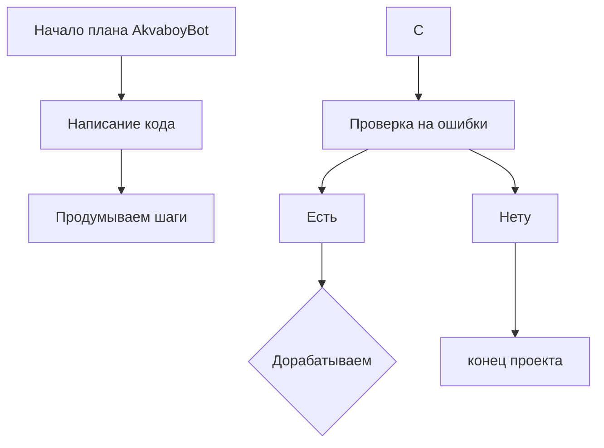

``` markdown
 Список героев:
1. Spider-man
- При чп помогает гражданским эвакуироваться и предотвращает катастрофу.
2. Hulk - Артемон
- Его вызывают в самом крайнем слуае,так как его силы не контролируется.
3. Akva-boy
- Помогает при водных катострофах.
4. Alexevich Bobrov
- Защищает своих родных от всемирного зла, имеет способность телепортации.
5. arsus
- Имеет спасобность превращатся в большого медведя, умеет превращать руки в пулиметы 


